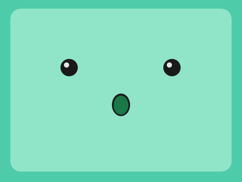
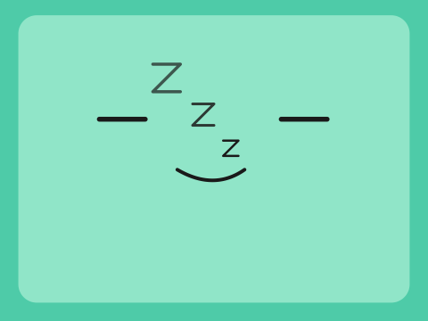

# BMO

> *Be more.*  Fullscreen BMO-inspired AI assistant and desk companion for NextUI handhelds.


[](https://ko-fi.com/carroarmato0)


---

## What is BMO?

BMO is a fullscreen, animated AI voice assistant and desk companion packaged
as a NextUI **Tool** pak. It runs entirely on-device, speaks via configurable
STT / Chat / TTS providers, and shows a living BMO face that reacts
emotionally to every exchange.

*Unofficial Adventure Time fan project — not affiliated with Cartoon Network
or Warner Bros.*

---

## Features

- **Animated SVG face** — 30+ expressions rendered at 60 fps, all driven by
  a declarative animation engine.
- **LLM-directed emotion** — the chat model picks BMO's expression; the face
  updates automatically.
- **Voice assistant pipeline** — push-to-talk → speech-to-text → chat →
  text-to-speech, with streaming audio playback.
- **Idle quotes & pre-recorded clips** — BMO mutters at you between
  interactions.
- **Device awareness** — BMO knows your game library, play history, and
  system stats, woven into its personality.
- **Mods** — swap BMO's face set, persona, voice style, quotes, and emotion
  vocabulary without touching code.
- **Idle and AI modes** — run BMO as a silent animated clock/companion or as
  a full voice assistant.
- **Reduced-motion option** — disable animations for lower CPU usage.

---

## Supported devices

| Platform | Devices |
| --- | --- |
| `tg5040` | TrimUI Brick · TrimUI Smart Pro |
| `tg5050` | TrimUI Smart Pro S |

The correct binary is selected automatically at launch.

---

## Gallery

| Neutral | Happy | Surprised | Love | Laugh | Sleeping |
| --- | --- | --- | --- | --- | --- |
|  |  |  |  |  |  |

---

## Installation

1. Download `BMO.pak.zip` from the [Releases](../../releases) page.
2. Unzip the archive — you will get a `BMO.pak/` folder.
3. Copy `BMO.pak/` onto your SD card:
   ```
   Tools/<platform>/BMO.pak/
   ```
   For example: `Tools/tg5040/BMO.pak/`
4. Eject the SD card, insert it into your device, and launch **BMO** from
   NextUI's Tools menu.

---

## Configuration

The config file is created automatically on first launch:

```
<dataRoot>/BMO/config.json
```

For example, on a TrimUI Smart Pro:

```
/mnt/SDCARD/.userdata/tg5040/BMO/config.json
```

### Minimal AI-mode example

```json
{
  "mode": "ai",
  "stt":  { "name": "openai-compatible", "model": "whisper-1", "api_key": "sk-..." },
  "chat": { "name": "openai-compatible", "model": "gpt-4o-mini", "api_key": "sk-..." },
  "tts":  { "name": "openai-compatible", "model": "gpt-4o-mini-tts", "voice": "nova", "api_key": "sk-..." },
  "ptt_buttons": ["A"],
  "active_mod": "",
  "reduced_motion": false
}
```

You can also configure everything on-device: press **Start** to open Settings,
or **Y** to open the AI Setup wizard.

### Controls

| Button | Action |
| --- | --- |
| A | Push-to-talk / confirm |
| B | Cancel / exit |
| Start | Open/close Settings |
| Y | Open AI Setup |
| Menu | Exit to NextUI |

---

## Mods

Mods are data-only directories that override BMO's face set, persona, voice
style, idle quotes, and emotion vocabulary — no code, no compilation needed.
Drop a mod folder into `<dataRoot>/BMO/mods/` and select it in
**Settings → MOD**.

See the [Modding guide](docs/MODDING.md).

---

## Building from source

```bash
# Build & test locally
CGO_ENABLED=1 go build ./...      # full build needs CGO (SDL)
CGO_ENABLED=0 go test ./...
golangci-lint run ./...

# Cross-compile + package the pak (docker/podman)
./scripts/release.sh

# Deploy to a connected device (ADB) or SD path
./scripts/deploy.sh
# Tail device logs
./scripts/debug-logs.sh
```

Requires Go 1.25. The release script uses Docker or Podman to cross-compile
for `tg5040` and `tg5050`.

---

## Support

[](https://ko-fi.com/carroarmato0)

If BMO brightens your handheld, consider [buying me a coffee](https://ko-fi.com/carroarmato0). 💖

---

## License

Released under the [MIT License](LICENSE).

*BMO is an unofficial fan project inspired by the Adventure Time character.
Not affiliated with or endorsed by Cartoon Network or Warner Bros.*
