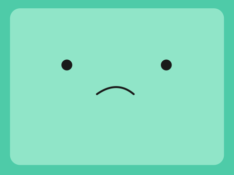

[← Modding guide](../MODDING.md) · Faces

# Face SVGs

BMO's expressions are SVG files placed in the mod's `faces/` directory.
An overlay mod (the `default` mod) overrides only the files you supply —
missing expressions fall back to the built-in BMO art. A self-contained
mod (any named mod that ships at least one `.svg`) owns its entire face
set; missing expressions fold to the mod's own `neutral.svg`.

---

## Illustrated expressions

| Neutral | Happy | Surprised | Love | Sad |
| --- | --- | --- | --- | --- |
|  |  |  |  |  |

---

## Expression catalog

Place any of these files in the mod's `faces/` directory to replace that expression.
You do not need to provide all of them — missing files use the built-in default
(overlay mods) or the mod's own `neutral.svg` (self-contained mods).

| File | Expression | When shown |
|------|-----------|------------|
| `neutral.svg` | Idle / default | Waiting for input |
| `blink.svg` | Blink | Periodic eye blink |
| `listening.svg` | Listening | PTT recording active |
| `thinking.svg` | Thinking | AI processing |
| `speaking.svg` | Speaking | TTS playback |
| `sleeping.svg` | Sleeping | Quota exhausted (animated) |
| `concerned.svg` | Concerned | Error / setup required |
| `smile.svg` | Smile | Gentle smile |
| `happy.svg` | Happy | Wide grin |
| `content.svg` | Content | Calm, eyes closed |
| `sad.svg` | Sad | Downturned mouth |
| `angry.svg` | Angry | Furrowed brows |
| `surprised.svg` | Surprised | Wide eyes, small "o" mouth |
| `excited.svg` | Excited | Gold star eyes |
| `love.svg` | Love | Red heart eyes |
| `shy.svg` | Shy | Blush, wavy mouth |
| `crying.svg` | Crying | Tear streams, wail |
| `teary.svg` | Teary | Welling eyes, worried brows |
| `gloomy.svg` | Gloomy | Downcast eyes, sweat drop |
| `dizzy.svg` | Dizzy | Spiral eyes |
| `unamused.svg` | Unamused | Half-lidded eyes, flat mouth |
| `annoyed.svg` | Annoyed | `-_-` dash eyes/mouth |
| `skeptical.svg` | Skeptical | One raised brow, half-lid |
| `playful.svg` | Playful | Wink, tongue out |
| `kiss.svg` | Kiss | `>` `<` eyes, `3` mouth |
| `grimace.svg` | Grimace | Clenched teeth |
| `shout.svg` | Shout | Angry brows, big open mouth |
| `dead.svg` | Dead / KO | `x_x` eyes |
| `glitch.svg` | Glitch | 8-bit pixel face |
| `dismayed.svg` | Dismayed | Wide eyes, `D:` gasp |
| `adoring.svg` | Adoring | Shiny eyes, blush, sparkles |
| `sparkle.svg` | Sparkle | Gold 4-point sparkle eyes |
| `look_around.svg` | Look around (idle) | Eyes scan left↔right during silence — time-animated |
| `whistle.svg` | Whistle (idle) | Pursed mouth + rising music note during silence — time-animated |

`look_around.svg` and `whistle.svg` are **idle animations**: BMO plays them on
its own while waiting, so they are templates driven by a clock rather than by
voice. Overriding them as a plain static `.svg` works too (you just lose the
motion). See [animations.md](./animations.md) for how the time driver works.

---

## SVG format

Every face is a **full scene** in a `280 × 210` viewBox. This is the exact
canonical layout every built-in face starts from — copy it verbatim so your
eyes and mouth line up with the rest of the set:

```svg
<svg xmlns="http://www.w3.org/2000/svg" viewBox="0 0 280 210">
  <!-- body -->
  <rect x="0" y="0" width="280" height="210" fill="#4ECBA8"/>
  <rect x="6" y="5" width="268" height="200" rx="26" ry="26" fill="#4ECBA8"/>
  <!-- screen -->
  <rect x="12" y="10" width="256" height="188" rx="12" ry="12" fill="#90e5c8"/>
  <!-- eyes -->
  <circle cx="80" cy="78" r="6.5" fill="#1a1a1a"/>
  <circle cx="199" cy="78" r="6.5" fill="#1a1a1a"/>
  <!-- mouth / expression goes here -->
</svg>
```

The viewBox is stretched non-uniformly to fill the screen (no letterboxing).
The TrimUI Smart Pro and Brick (tg5040) both run at 1024×768 (4:3). Design
faces in a 4:3 proportion and they will render correctly on device. Verify
resolution with `adb shell cat /sys/class/graphics/fb0/modes` if you are
unsure about a target device.

**Supported elements:** `path` (all commands), `rect`, `circle`, `ellipse`,
`line`, `polygon`, `polyline`, `g`, `defs`/`use`, `transform`,
fill/stroke/opacity, linear and radial gradients.

**Not supported:** `clipPath`, masks, filters, `text`, CSS classes or
stylesheets, `pattern`, embedded images. A file that fails to parse is logged
and the built-in default is used instead — BMO never shows a broken face.

---

## Alias names

You can also use alias filenames. For example, `cry.svg` resolves to `crying`,
`shocked.svg` to `surprised`, and `tongue.svg` to `playful` when no exact
override exists. The lookup order is: exact filename → canonical name → built-in
default. (`happy`, `excited`, `sad`, and `angry` are now their own
expressions, not aliases of `smile`/`concerned`.)

---

## Lip-syncing mouth (`{{.m}}` templates)

A face can animate its mouth in time with BMO's voice. To do this, write the
SVG as a **Go template** with a single parameter `.m` — the mouth openness,
`0.0` at rest rising to `1.0` at full volume. BMO renders the template at six
openness levels and steps through them with the live audio amplitude.

Every built-in emotion uses the same two-line idiom: declare `$m`, draw your
own resting mouth at `$m == 0`, and delegate every open level to the shared
`talkmouth` partial (the teeth-and-tongue mouth built into BMO, auto-registered
for every face template):

```svg
<svg xmlns="http://www.w3.org/2000/svg" viewBox="0 0 280 210">{{$m := or .m 0.0}}
  <rect x="0" y="0" width="280" height="210" fill="#4ECBA8"/>
  <rect x="6" y="5" width="268" height="200" rx="26" ry="26" fill="#4ECBA8"/>
  <rect x="12" y="10" width="256" height="188" rx="12" ry="12" fill="#90e5c8"/>
  <circle cx="80" cy="78" r="6.5" fill="#1a1a1a"/>
  <circle cx="199" cy="78" r="6.5" fill="#1a1a1a"/>
  {{if eq $m 0.0}}
  <path d="M 116 111 Q 140 125 160 111" stroke="#1a1a1a" stroke-width="4" fill="none" stroke-linecap="round"/>
  {{else}}{{template "talkmouth" $m}}{{end}}
</svg>
```

You are free to ignore `talkmouth` and draw your own mouth shapes keyed off
`$m` thresholds instead — `talkmouth` is just the built-in BMO mouth offered as
a shortcut. The arithmetic helpers `add`, `sub`, and `mul` are available inside
templates (e.g. `{{printf "%.1f" (add 106.0 (mul $m 4.0))}}`).

If your override has **no** `{{` markers it is used as a **static face** during
speech — BMO will not animate the mouth, but your design will display correctly.
The dedicated `speaking.svg` face shown during TTS is the one exception in the
built-in set: it is a six-frame `speaking_0…speaking_5` sequence (see
[animations.md](./animations.md)) rather than an `.m` template.

> **Idle animations** (`look_around.svg`, `whistle.svg`, `sleeping.svg`) are
> also templates, but driven by *time* rather than amplitude — their parameter
> is a clock value (`.x` for the eye scan, `.t` for the note/Z drift). See
> [animations.md](./animations.md) for the driver details.

---

## Previewing your faces

**On the device (recommended for mod authors).** Press the **Y** button while
BMO is idle to step through every face the active mod resolves — one face (or
idle animation) per press. This is the quickest way to confirm your overrides
load, are centred, and animate as intended, without waiting for the idle
scheduler to cycle to them. Any interaction (a quote, push-to-talk, exit)
returns BMO to normal idle behaviour. Press **X** to hear a random `quotes.txt`
line in your mod's voice.

**On a desktop (maintainers).** Render the full embedded face set with:

```
go run ./cmd/render-faces
```

On-device rendering uses the `oksvg` library. ImageMagick (`rsvg`) and browsers
may render SVG arc sweeps differently. To catch device-specific differences
before deploying, preview via `face.Rasterize` (the same path the device uses)
rather than a desktop SVG viewer. In particular, degenerate arc sweeps that look
correct in ImageMagick can render opposite on the device — use Bézier curves for
rounded shapes where precision matters.

---

## Technical notes

- Face files are re-read on each expression change; editing a file takes effect
  at the next expression transition (no restart needed).
- Persona, voice, and quotes are re-read before each AI interaction; changes
  take effect immediately.
- The renderer cross-compiles for tg5040/tg5050 using LoveRetro toolchain
  containers (`scripts/release.sh`). The `internal/face` package is pure Go
  and adds no CGO or platform-specific dependencies.
